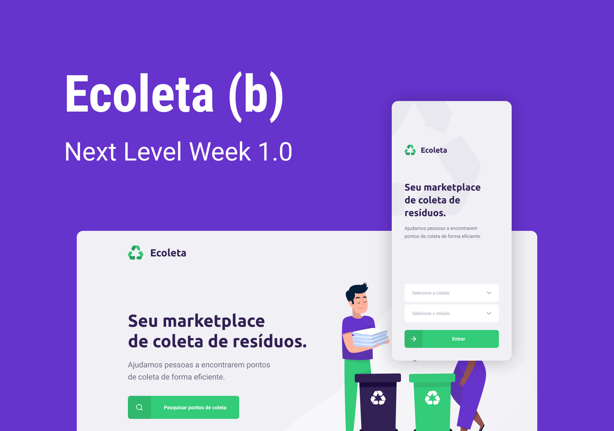

# Projeto NLW - Ecoleta

O projeto foi construido durando a Next Level Week graças a Rockerseat.
O aplicativo Ecoleta cadastra pontos de coleta de resíduos reciclaveis em uma aplicação WEB e os apresenta em uma aplicação Mobile.

## Tecnologias
- React
- React Native
- Expo
- NodeJS
- Axios
- TypeScript

# Funcionalidades Web
- Cadastrar pontos de coleta.
- Uso de Geolocalização para marcação de pontos no mapa.
- Utilização da API do IBGE para retornar Estados e Municípios.

## Preview

# Funcionalidade Mobile
- Visualizar pontos de coleta no mapa
- Buscar pontos de coleta de acordo com Cidade, Estado e items de coleta
- Enviar E-Mail e Whatsapp para o ponto de coleta diretamente do app

## Preview

